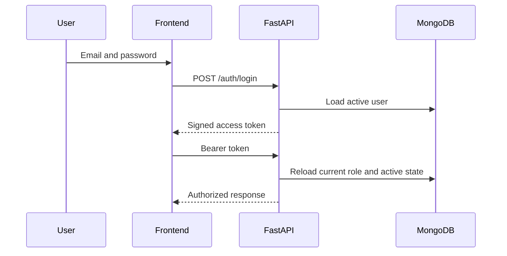
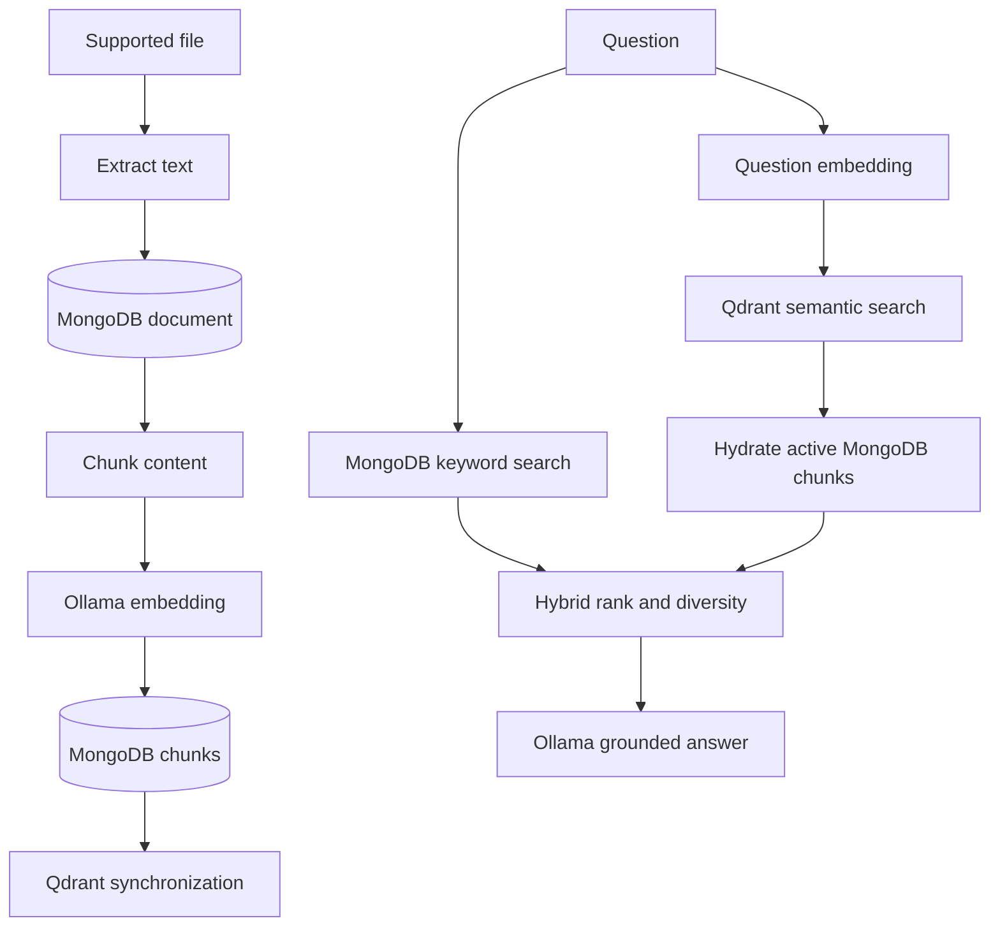
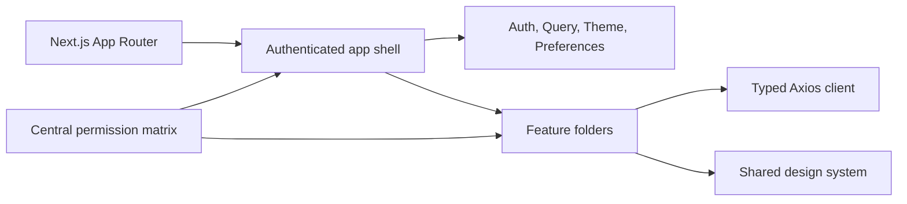

# Architecture

## Authentication

Tokens never determine current authorization alone; protected requests reload the user.

## Ingestion and retrieval

## Frontend

Feature folders own API contracts and interactive views. Shared providers own session, query behavior, themes, and validated local preferences.

## Maintenance

Admin-confirmed backfills create missing chunks or embeddings and synchronize eligible vectors. Results are returned synchronously; the frontend keeps only a clearly labeled browser-session history.
