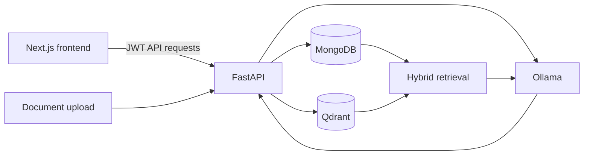

# CGC Knowledge AI

Your company knowledge, instantly accessible.

CGC Knowledge AI is an authenticated internal knowledge assistant. It ingests company documents, creates embedded chunks, synchronizes vectors to Qdrant, combines keyword and semantic retrieval, and returns grounded answers with citations.

## Capabilities

- JWT authentication with Employee, Editor, and Admin roles
- Role-aware dashboard and navigation
- Grounded AI chat with source citations and local user-scoped history
- Document catalog, metadata editing, and Admin deletion
- TXT, Markdown, PDF, and DOCX ingestion
- Admin user management
- Health, readiness, and retrieval maintenance tools
- Light, dark, and system themes
- Versioned local preferences, offline awareness, reduced-motion support
- Responsive, keyboard-accessible enterprise UI

## Architecture



MongoDB is authoritative for users, documents, chunks, active state, and stored embeddings. Qdrant is a derived semantic index. Qdrant results are rehydrated from MongoDB before use.

See [ARCHITECTURE.md](ARCHITECTURE.md), [DEPLOYMENT.md](DEPLOYMENT.md), and [SECURITY.md](SECURITY.md).

## Roles

| Capability | Employee | Editor | Admin |
| --- | ---: | ---: | ---: |
| Chat and browse documents | Yes | Yes | Yes |
| Upload and edit documents | No | Yes | Yes |
| Delete documents | No | No | Yes |
| Manage users and maintenance | No | No | Yes |

Backend authorization is authoritative; frontend permissions are user-experience boundaries.

## Prerequisites

- Python 3.12
- Node.js 22+
- MongoDB
- Qdrant
- Ollama with `llama3.2` and `nomic-embed-text`

```powershell
ollama pull llama3.2
ollama pull nomic-embed-text
```

## Local setup

Backend:

```powershell
cd backend
python -m venv venv
.\venv\Scripts\Activate.ps1
python -m pip install -r requirements.txt
Copy-Item .env.example .env
uvicorn app.main:app --reload
```

Frontend:

```powershell
cd frontend
npm ci
Copy-Item .env.example .env.local
npm run dev
```

Default local endpoints:

- Frontend: `http://localhost:3000`
- Backend/OpenAPI: `http://localhost:8000` and `/docs`
- Qdrant: `http://localhost:6333`
- Ollama: `http://localhost:11434`

Generate a production JWT secret:

```powershell
python -c "import secrets; print(secrets.token_urlsafe(64))"
```

Configure bootstrap Admin credentials in `backend/.env`; startup creates the account only when it does not exist. Remove the bootstrap password after initial provisioning.

## Verification

```powershell
cd backend
.\venv\Scripts\python.exe -m pytest -q
.\venv\Scripts\python.exe -c "from app.main import app; print(app.title)"

cd ..\frontend
npm run lint
npx tsc --noEmit
npm run build
npm run start
```

## Known limitations

- JWTs are stored in browser storage; migrate to secure HTTP-only cookies for stronger production protection.
- No refresh-token or self-service password-reset flow exists.
- Profile changes are Admin-managed.
- Preferences and chat history are browser-local.
- Maintenance history is current-session only.
- Detailed MongoDB and Ollama component health is not exposed.
- Ollama is expected to run on the host unless deployment architecture explicitly changes.

## Production checklist

- [ ] Unique JWT secret of at least 32 characters
- [ ] Bootstrap credentials removed or rotated
- [ ] Exact production CORS origins
- [ ] Production frontend and API URLs
- [ ] Persistent MongoDB and Qdrant storage
- [ ] Required Ollama models available
- [ ] `/health` and `/ready` pass
- [ ] Embedding/vector backfills complete
- [ ] Frontend build and backend tests pass
- [ ] Roles, uploads, citations, and logout verified
- [ ] Backups, logs, monitoring, and TLS configured

The next activity is the separately authorized final full-system test matrix.
