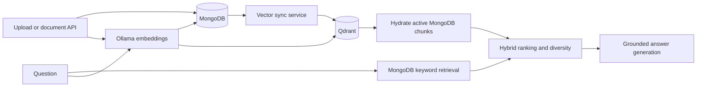

# Smart Internal Knowledge Base Assistant

An internal-document assistant built with FastAPI, MongoDB, Ollama, and Qdrant. It ingests company documents, creates embedded chunks, retrieves grounded context with hybrid keyword/vector search, and returns answers with authoritative sources.

## Phase 8 architecture



- **MongoDB** is authoritative for documents, active chunk state, metadata, content, and stored embeddings.
- **Qdrant** is a derived, indexed representation used for nearest-neighbor semantic candidate retrieval. Qdrant payloads are never trusted without hydrating active MongoDB chunks.
- **Ollama** generates `nomic-embed-text` embeddings and runs the configured answer model.

Qdrant point IDs are deterministic UUIDs derived from MongoDB chunk IDs. Repeated upserts and vector backfills therefore update existing points instead of creating duplicates.

## Local services

Start Qdrant with persistent local storage:

```powershell
docker run --name knowledge-qdrant -p 6333:6333 -p 6334:6334 -v qdrant_storage:/qdrant/storage qdrant/qdrant:latest
```

Install and start the backend:

```powershell
cd C:\Users\DELL\Desktop\smart-internal-knowledge-base-assistant\backend
python -m venv venv
.\venv\Scripts\Activate.ps1
python -m pip install -r requirements.txt
uvicorn app.main:app --reload
```

MongoDB and Ollama must also be running for ingestion and normal question answering.

## Qdrant configuration

Copy `backend/.env.example` to `backend/.env` and configure:

| Variable | Default | Purpose |
| --- | --- | --- |
| `QDRANT_ENABLED` | `true` | Enables vector-store startup, write synchronization, and Qdrant retrieval. |
| `QDRANT_URL` | `http://localhost:6333` | Qdrant HTTP endpoint. |
| `QDRANT_API_KEY` | empty | Optional API key; blank values become `None`. |
| `QDRANT_COLLECTION_NAME` | `document_chunks` | Vector collection name. |
| `QDRANT_VECTOR_SIZE` | `768` | Required embedding dimensions. |
| `QDRANT_DISTANCE` | `cosine` | Distance metric (`cosine`, `dot`, `euclid`, or `manhattan`). |
| `QDRANT_TIMEOUT_SECONDS` | `10` | Provider request timeout. |
| `QDRANT_SEMANTIC_LIMIT` | `30` | Semantic candidates requested per query. |
| `QDRANT_BATCH_SIZE` | `100` | Maximum points per upsert batch. |
| `QDRANT_SYNC_ON_WRITE` | `true` | Synchronizes successful document writes to Qdrant. |
| `QDRANT_FALLBACK_ENABLED` | `true` | Keeps startup and queries operational when Qdrant is unavailable. |

All limits, vector size, batch size, and timeout values must be positive. Existing hybrid weights and relevance thresholds remain configurable independently.

## Synchronization behavior

- **Create/upload:** MongoDB document and embedded chunks are created first, then the new chunks are upserted into Qdrant.
- **Update:** old MongoDB chunks are deactivated, replacement chunks are created, old document vectors are removed, and replacement vectors are upserted.
- **Delete:** the MongoDB document/chunks are deactivated and Qdrant points for the document are removed idempotently.
- **Fallback-enabled synchronization failure:** valid MongoDB state is preserved and the failure is logged. Stale Qdrant points cannot be returned because query results are rehydrated and checked against active MongoDB chunks.
- **Mandatory Qdrant:** when fallback is disabled, synchronization/retrieval failures raise controlled service errors and lifecycle rollback follows the existing MongoDB rules.
- **Embedding/chunk maintenance:** these jobs update MongoDB. Run the vector backfill afterward to make Qdrant exactly reflect all eligible active chunks.

Backfill all valid active vectors idempotently:

```powershell
Invoke-RestMethod -Method Post -Uri http://localhost:8000/maintenance/backfill-vectors
```

## Query fallback

The normal query path generates one question embedding, retrieves keyword candidates from MongoDB, retrieves semantic candidates from Qdrant, hydrates current active chunks from MongoDB, merges by chunk ID, applies hybrid weights and thresholds, removes redundant context, enforces document diversity, and sends grounded context to the answer model.

If Qdrant is disabled, the existing local Python semantic retrieval is used. If Qdrant is unavailable and fallback is enabled, the application logs a warning and uses local semantic retrieval; keyword retrieval remains available. If question embedding generation fails, retrieval degrades to keyword-only. If fallback is disabled, the query endpoint returns HTTP 503 without exposing provider details.

`GET /health` remains a basic liveness endpoint. `GET /ready` reports Qdrant as `ready`, `disabled`, or `unavailable`; fallback-enabled unavailability reports a degraded but operational application.

## Verification

Inspect collection information and point count:

```powershell
Invoke-RestMethod http://localhost:6333/collections/document_chunks
Invoke-RestMethod http://localhost:6333/collections/document_chunks/points/count -Method Post -ContentType 'application/json' -Body '{"exact":true}'
```

Upload a document and ask a question:

```powershell
Set-Content -Path .\phase8-policy.txt -Value 'Remote work requires manager approval.'
curl.exe -X POST http://localhost:8000/uploads/ -F "file=@phase8-policy.txt" -F "category=HR"
$body = @{ question = 'What is the remote work policy?'; category = 'HR' } | ConvertTo-Json
Invoke-RestMethod -Method Post -Uri http://localhost:8000/query/ -ContentType 'application/json' -Body $body
```

Test fallback by stopping Qdrant and repeating the query:

```powershell
docker stop knowledge-qdrant
Invoke-RestMethod -Method Post -Uri http://localhost:8000/query/ -ContentType 'application/json' -Body $body
docker start knowledge-qdrant
```

Run automated verification:

```powershell
cd C:\Users\DELL\Desktop\smart-internal-knowledge-base-assistant\backend
.\venv\Scripts\python.exe -m pytest -q
.\venv\Scripts\python.exe -m pytest tests\test_qdrant_store.py tests\test_vector_backfill.py tests\test_vector_lifecycle.py tests\test_qdrant_retrieval.py tests\test_query_service.py tests\test_search_repository.py tests\test_vector_startup.py -v
.\venv\Scripts\python.exe -c "from app.main import app; print('Application imports successfully')"
```
